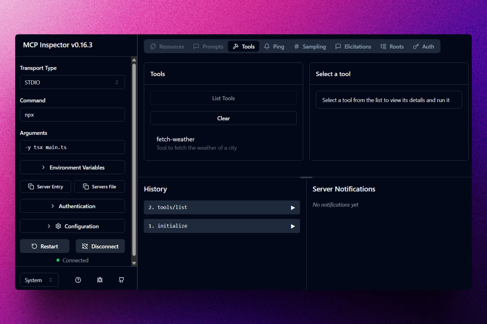
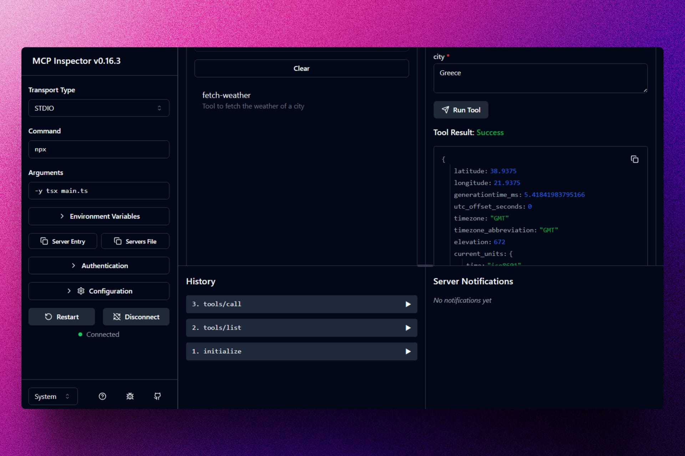

<div align='center'>

# 🔌 TypeScript: MCP (Model Context Protocol)

</div>

### Pequeño servidor MCP de práctica con una herramienta para consultar el clima.





## 🚀 Descripción

Este repositorio contiene un servidor de ejemplo construido con `@modelcontextprotocol/sdk` en TypeScript. Expone una herramienta (`fetch-weather`) que consulta el clima actual usando Open‑Meteo, valida la entrada con Zod y se comunica por `stdio` para integrarse con clientes compatibles con MCP.

- Archivo principal: `main.ts`
- Herramienta incluida: `fetch-weather` (parámetro: `city` como `string`)
- Salida: información del clima en formato JSON (día actual y temperatura, entre otros).

## ⚡ Comenzar

### Prerrequisitos

1. Git
2. Node.js 20 o superior
3. Un gestor de paquetes (pnpm o npm)
4. (Opcional) Un cliente MCP compatible para conectarse por `stdio` (p. ej., Claude Desktop u otro cliente MCP)

## 🔧 Instalación

1. Clona el repositorio:

   ```bash
   git clone https://github.com/abrahamgalue/mcp-practice.git
   cd mcp-practice
   ```

2. Instala las dependencias (elige tu gestor):

   ```bash
   # con pnpm
   pnpm install

   # o con npm
   npm install
   ```

## ▶️ Ejecución

Este servidor se comunica por `stdio`. La forma recomendada para probarlo localmente es usar el MCP Inspector:

```powershell
npx -y @modelcontextprotocol/inspector npx -y tsx main.ts
```

- Con esto podrás inspeccionar y ejecutar la herramienta `fetch-weather` de forma interactiva.
- Para integrarlo con un cliente MCP, configura el cliente para ejecutar el mismo comando en este directorio.

## 🧰 Herramientas disponibles

- fetch-weather
  - Descripción: Obtiene el clima de una ciudad.
  - Parámetros: `{ city: string }`
  - Respuesta: bloque de texto con JSON de Open‑Meteo (pronóstico del día actual).

Notas:

- Si la ciudad no se encuentra, retorna un mensaje indicando que no hubo resultados.
- Usa la API de geo-codificación y pronóstico de Open‑Meteo (no requiere API key).

## 🎭 Tecnologías

- [@modelcontextprotocol/sdk](https://github.com/modelcontextprotocol) para implementar el servidor MCP
- [Zod](https://zod.dev/) para validación de esquemas
- [Node.js](https://nodejs.org/) y TypeScript para el runtime/desarrollo
